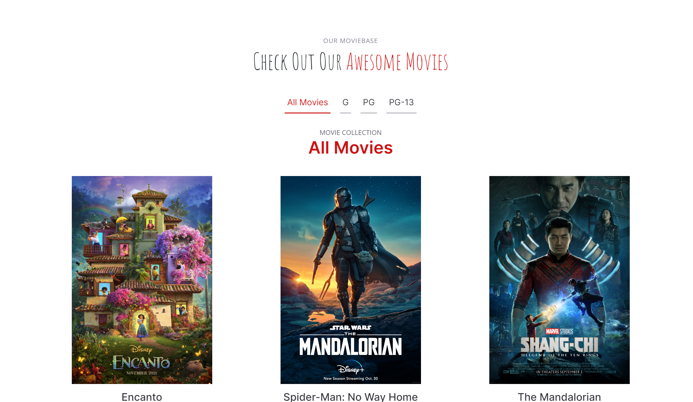

# Movies IaC - AWS
## Web app for displaying various movies. Please Known Issues / Future Improvements section first. 
This is a web application that provides users an interactive interface to explore different movies. Users can sort movies saved to the database based on their parental rating. 

## Visual

## Setup
Runningly locally
- git clone https://github.com/smurthw8/moviesgit2.0.git
- cd moviesgit2.0
- npm install
- node index.js
- Navigate to http://localhost:3000 to see the website

Setup for the Cloud (make sure you have terraform installed)
- git clone https://github.com/smurthw8/moviesgit2.0.git
- Replace the "Change Me" variables in moviesgit2.0/iac/modules/setup/setup.tf in your editor
- Replace the "Change Me" variables in moviesgit2.0/iac/modules/app/main.tf in your editor
- cd moviesgit2.0/iac/dev/setup
- Terraform init
- Terraform plan (If you want to see what will be built easily)
- Terraform apply 
- Perform additional setup. You will need to ssh into your db and setup the tables and populate with data
- You will also need to change the db connections in index.js to match your database.

## Develop Instructions
This project honestly still needs a TON of work before it is completely finished. Feel free to clone or fork the repo, and continue the fun. 

## Contributer Instructions
Before you decide to be a hero and tear this project limb from limb, please see the section below and take a look at what needs to be done. If you would like to work on said issues, or provide useful feedback, feel free to create a pull request and submit it. Please include many comments that explain your reasoning behind your choices and ideas so that we can learn and grow from your expertise. 

## Known Issues / Future Improvements
There are many, but here are acouple:
     
Github Actions:
- Create a .github/workflows folder. Inside it create a ci.yml (continuous integration) and a cd.yml (continous integration) file. 
- Add a github secret for the aws access key and secret. Include those in as varibles in the matrix. 
- Include eslint, terraform fmt, npm audit, and other code checks. 
- Do all the fun stuff
     
Terraform: 
- Develop and follow a naming convention for resources
- Go through and update tagging to include name, and other tags. 
- Change Database to instead create a random username and password that are encrypted and stored in the parameter store.
- Audit and change security groups, and vpc to follow the principle of least privlege
     
 App:
- Create a v1.yml open api document to use for the api. Enforce it with API enforcer. [Swagger Editor](https://editor.swagger.io/)
- Query aws to retrieve the parameters needed for the database username, and password from the parameter store. Retrieve the host through env variables. 
     
## Sponser poor college students?
- [Thomas Blackwelder]()
- [Caleb Siebach](https://venmo.com/code?user_id=2946059366039552553&created=1665890984)
- [Cole Smith]()
- [Kirsten Smurthwaite]()

## Acknowledge 
Too many youtube tutorials to count, and our great Professor Kettles, and TA's
